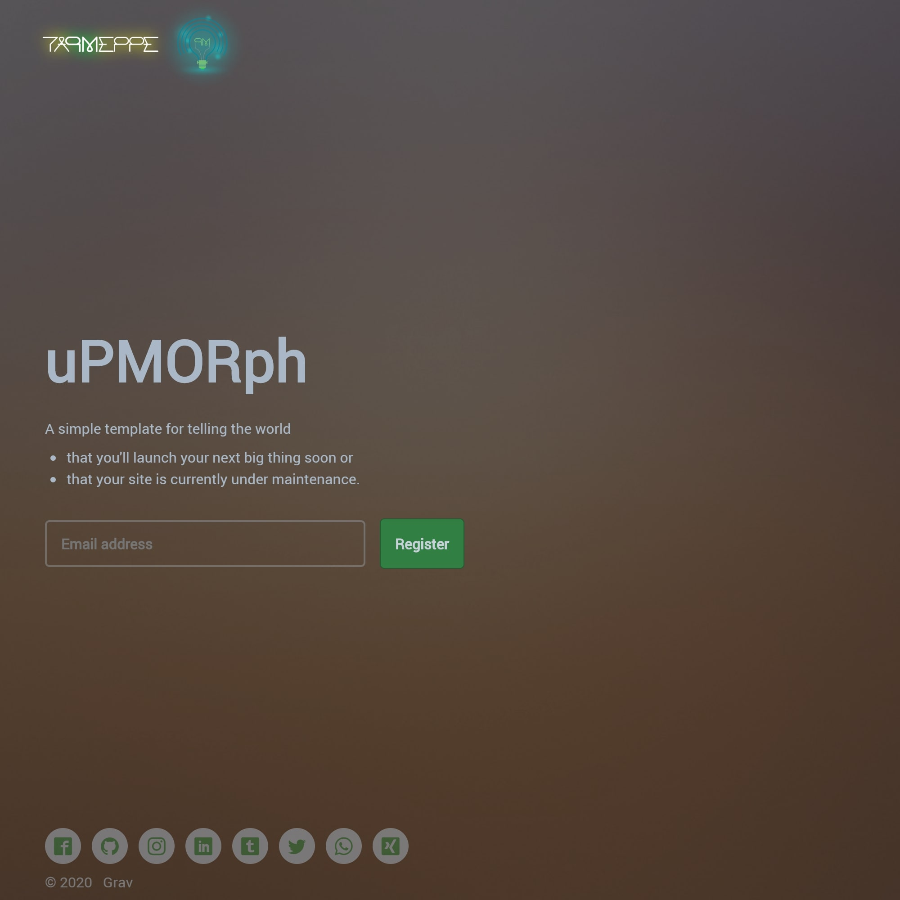

# uPMORph online soon :cool: :new: :soon:



**uPMORph online soon** is a theme developed by [taPMeppe solutions](https://tapmeppe.solutions) for the [GRAV CMS](https://getgrav.org/). 
It is based on the free template [Eventually | HTML5 UP](https://html5up.net/eventually). :loudspeaker: :+1:

It should be used as kickass placeholding template to
- either comfort the public until your kickass project/app/product/startup launches (online soon) :construction: ,
- or set your site on maintenance (**back** online soon) :hammer_and_wrench: . 


# Installation :nut_and_bolt:
Installing this theme can be done in one of two ways. The GPM (_Grav Package Manager_) installation method enables you to quickly and easily install the theme with a simple terminal command, while the manual method enables you to do so via a zip file.

### GPM Installation (_Preferred_)
The simplest way to install this theme is via the [Grav Package Manager (GPM)](http://learn.getgrav.org/advanced/grav-gpm) through your system's Terminal (_also called the command line_). From the root of your Grav install type:
```
bin/gpm install upmorph-online-soon
```
This will install this theme into your `/user/themes` directory within Grav. Its files can be found under `/your/site/grav/user/themes/upmorph-online-soon`.

### Manual Installation
To install this theme, just download the zip version of this repository and unzip it under `/your/site/grav/user/themes`. Then, rename the folder to `upmorph-online-soon`. You can find these files either via [GetGrav.org](https://getgrav.org/downloads/themes) or on [GitHub](https://github.com/taPMeppeSols/grav-theme-upmorph-online-soon).

You should now have all the theme files under
```
/your/site/grav/user/themes/upmorph-online-soon
```


# Updating :gear:
As development for this theme continues, new versions may become available that add additional features and functionality, improve compatibility with newer Grav releases, and generally provide a better user experience. Updating this theme is easy, and can be done through Grav's GPM system, as well as manually.

### GPM Update (_Preferred_)
The simplest way to update this theme is via the [Grav Package Manager (GPM)](http://learn.getgrav.org/advanced/grav-gpm). You can do this with this by navigating to the root directory of your Grav install using your system's Terminal (_also called command line_) and typing the following:
```
bin/gpm update upmorph-online-soon
```
This command will check your Grav install to see if this theme is due for an update. If a newer release is found, you will be asked whether or not you wish to update. To continue, type `y` and hit `enter`. The theme will automatically update and clear Grav's cache.

### Manual Update
Manually updating this theme is pretty simple. Here is what you will need to do to get this done:
* Delete the `your/site/user/themes/upmorph-online-soon` directory.
* Download the new version of the this theme from either via [GetGrav.org](http://getgrav.org/downloads/themes).
* Unzip the zip file in `your/site/user/themes` and rename the resulting folder to `upmorph-online-soon`.
* Clear the Grav cache. The simplest way to do this is by going to the root Grav directory in terminal and typing `bin/grav clear-cache`.

> Note: Any changes you have made to any of the files listed under this directory will also be removed and replaced by the new set. Any files located elsewhere (_for example a YAML settings file placed in_ `user/config/themes`) will remain intact.


# Setup :electric_plug:
If you want to set this theme as the default theme, you can do so by following these steps:
* Navigate to `/your/site/grav/user/config`.
* Open the **system.yaml** file.
* Change the `theme:` setting to `theme: upmorph-online-soon`.
* Save your changes.
* Clear the Grav cache. The simplest way to do this is by going to the root Grav directory in Terminal and typing `bin/grav clear-cache`.

Once this is done, you should be able to see the new theme on the frontend. Keep in mind any customizations made to the previous theme will not be reflected as all of the theme and templating information is now being pulled from the **upmorph-online-soon** folder.


# Customisation :hammer: :wrench:
All customisation should be done using [theme inheritance](https://learn.getgrav.org/16/themes/customization#theme-inheritance) to allow for future updates. This way we can keep updating and you can keep the feature you care about. I hope we all have as much fun as we. Good luck :smiley: :muscle: :metal: .


# Preview :see_no_evil: :hear_no_evil: :speak_no_evil:
The theme created as response to our need for a simple and lightweight solution for the online presence of our team in the year 2019. Therefore, currently there is no better preview than our homepage: https://tapmeppe.solutions .


# You want to support us? :ok_hand: :gift:
No problem buddy. We can always use some loose change :money_with_wings: for a cup of :coffee:. You can donate [here](https://paypal.me/tapmeppesols). 

# :v: :wave: :end:
